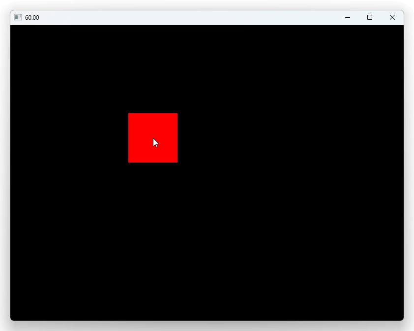
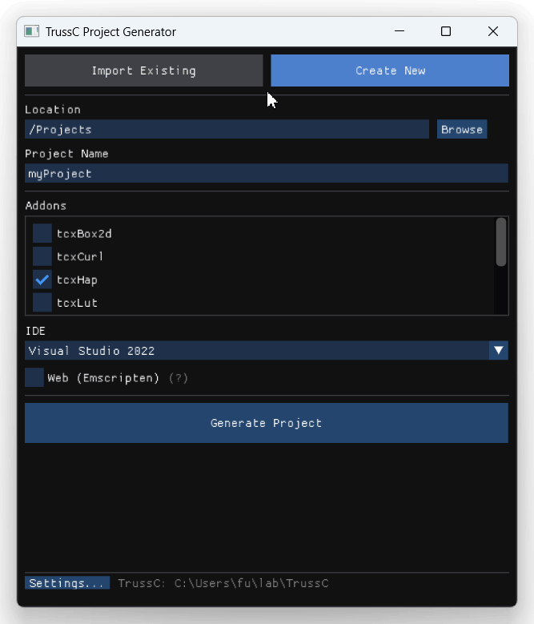

# TrussC-nim

[TrussC](https://github.com/TrussC-org/TrussC) nim integration

- TrussC version [v0.3.1 (2e8381a)](https://github.com/TrussC-org/TrussC/commit/2e8381a17b46edc4234925558ba336f753276e23)
- nim v2.2.8



```nim
import tcApp
import std/strformat
import nimline
import consoleUtil

{.emit: """
#include "TrussC.h"

using namespace trussc;
using namespace tc;
""".}

proc red {.importcpp: "tc::colors::red" .}

proc setup() {.cdecl.} =
  discard global.setFps(60)
  discard global.logNotice("hello Trussc!")

proc update() {.cdecl.} =
  let r: float = global.getFrameRate()
  let s = fmt"{r:.2f}"
  discard global.setWindowTitle(s)

proc draw() {.cdecl.} =
  discard global.setColor(red)
  discard global.drawRect(
    global.getMouseX() - 50,
    global.getMouseY() - 50,
    100, 100)

proc keyPressed(key: cint) {.cdecl.} =
  let ckey = cast[char](key)
  if ckey == 'f' or ckey == 'F':
    discard global.toggleFullscreen()
  elif key == global.KEY_ESCAPE or ckey == 'q' or ckey == 'Q':
    discard global.exitApp()

when isMainModule:
  showConsole() # this is necessary to see logs
  var app = makeTcApp(setup=setup, update=update, draw=draw, keyPressed=keyPressed)
  app.run(800, 600)
```

## Pre-requisites

### Windows

```bash
$ .¥scripts¥init_win.ps1
```

### Mac

```bash
$ ./scripts/init_mac.sh
```

## Examples

```bash
$ nim c -r examples/hello.nim
$ nim c -r examples/cpp_interop.nim
```

## How to use tcx addons

- At first, create `xxx.nim.addons` at side of the nim file.
    ```txt
    tcxOsc
    ```
- Copy tcxXXX folder into `addons/tcxXXX` (such as tcxOsc) from openFrameworks directory (or other github repository)
- Then try `nim c -r examples\osc_test.nim`
    - You can debug addon parse log by  `-d:addonsDebug`, such as `nim c -d:addonsDebug -r examples\osc_test.nim`

### NOTE 1: `import tcx_addons`

When you use ofx addons, you need `import tcx_addons` on nim side. This includes `generated/addon_dependencies.nim` on nim side, in order to compile required C++ files.

See [`examples/osc_test.nim`](examples/osc_test.nim) for detail.

### NOTE 2: prebuilt libs for CMakeLists.txt

Some addons have `CMakeLists.txt` in it, but TrussC-nim can't treat CMake.

In this case, in order to treat them on linker, you should put prebuilt files into `prebuilt/vs` (windows) or `prebuilt/osx` (mac) folder in `addons/tcxXXX`.

For example `tcpHap`, you should first create emptyProject using `tcpHap` by projectGenerator of original version of TrussC (not TrussC-nim).



And just build it (in release build mode) using Visual Studio or Xcode.

Then you can find `.lib` or `.a` on project folders. You can find them by command such as `fd -uu lib$` (using [fd-find command](https://github.com/sharkdp/fd)) in the project folder.

```bash
$ fd -uu lib$
vs\_deps\snappy-build\Release\snappy.lib
vs\addons\tcxHap\Release\tcxHap.lib
```

Put all of them into `prebuilt/vs` or `prebuilt/osx`. in this case:

```
tcxHap
├── prebuilt
│   └── vs
│       ├── snappy.lib
│       └── tcxHap.lib
```

Now you can build them. If you have (need) additional headers (such as `hap.h`), please put them into `addons/tcxXXX/src` or root `include` folder.

(For tcxHap, I prepared [tcxHap.zip](https://github.com/funatsufumiya/TrussC-nim/releases/download/v0.0/tcxHap.zip) having necessary prebuilt files for vs/osx.)

## TODO

- Linux support (etc)
